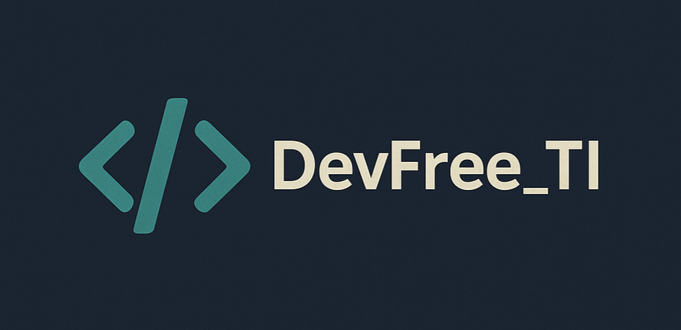

[PROJECT__BADGE]: https://img.shields.io/badge/📱Visit_this_project-000?style=for-the-badge&logo=project
[PROJECT__URL]: https://dev-free-ti.vercel.app

  

Índice

 
- [📌 Sobre](#started)

- [📍 Rotas da aplicação](#routes)

<h2 id="started">📌 Sobre</h2>

Este site foi desenvolvido como um portfólio, 100% autoral, com o objetivo de praticar minhas habilidades em React e Tailwind CSS. Além disso, funciona como uma vitrine para exibir futuros projetos pessoais e profissionais, servindo como referência para oportunidades comerciais.

[![project][PROJECT__BADGE]][PROJECT__URL]

<h2 id="routes">📍 Rotas da aplicação</h2>

| rotas             | descrição                                          
|----------------------|-----------------------------------------------------
| <kbd>/</kbd>     | página home
| <kbd>/about</kbd>     | página com informações sobre a DevFree_TI

